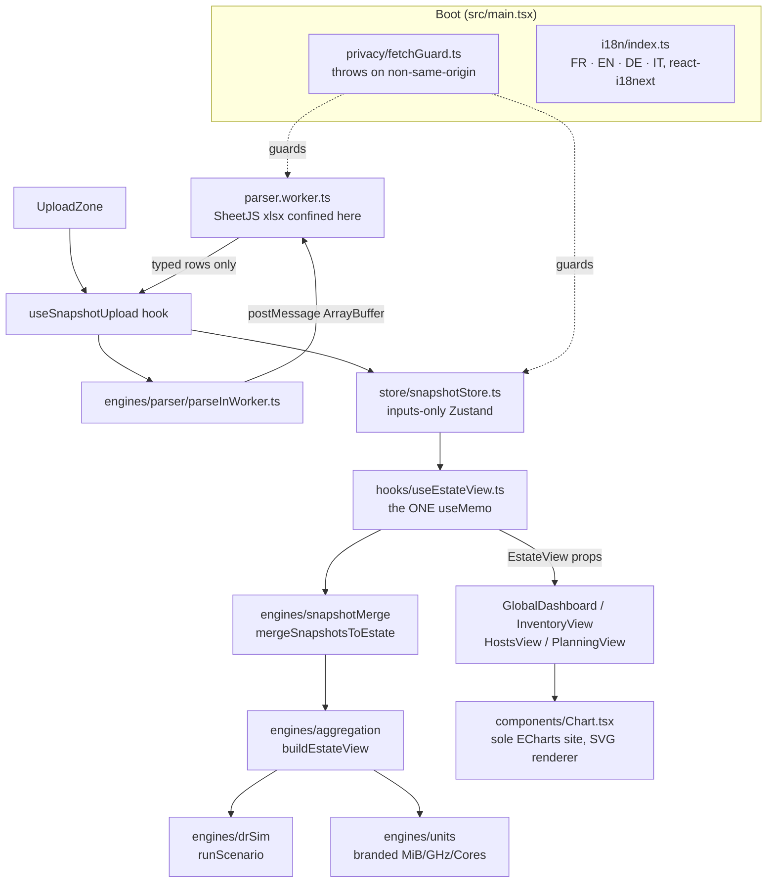

<!-- generated-by: gsd-doc-writer -->
# Architecture

## System overview

vatlas is a 100% client-side React 19 + Vite 8 single-page application. It ingests one or more RVTools `.xlsx` workbook exports entirely in the browser, normalizes them into typed snapshot rows, merges the selected snapshots into a single logical VMware estate, derives every aggregate (totals, allocation ratios, DR what-if results, per-cluster/per-host/per-datastore breakdowns) as pure functions, and renders dashboards, inventory trees, host views, and capacity planning. No workbook byte ever leaves the browser — a runtime privacy guard throws synchronously on any non-same-origin network attempt. The architecture is a strict three-tier separation: a pure-function **engines** layer (no React/DOM/Zustand), an inputs-only **Zustand store**, and a UI layer bridged by exactly one `useMemo` site (`useEstateView`). Engineering principles are binding: KISS, DRY, functional programming — engines are pure, the store holds inputs only, and derived state is computed downstream, never cached.

## Component diagram



The data-flow direction `A → B` means A calls or sends data to B. SheetJS (`xlsx`) is confined to `parser.worker.ts` and never imported on the main thread. ECharts is imported only in `components/Chart.tsx`.

## Data flow

A typical request — a user drops one or more RVTools workbooks and views the dashboard — moves through the system as follows:

1. **Boot.** `src/main.tsx` imports `./privacy/fetchGuard` as its first statement, before any other module. The guard monkey-patches `globalThis.fetch`, `XMLHttpRequest.prototype.open`, `navigator.sendBeacon`, and `globalThis.WebSocket` to throw synchronously on any non-same-origin URL (`PrivacyViolation`) or cleartext WebSocket scheme (`InsecureTransportViolation`). `./i18n` initializes next so translation keys resolve on first paint.
2. **Upload.** `components/UploadZone.tsx` hands dropped `File[]` to the `useSnapshotUpload` hook (`src/hooks/useSnapshotUpload.ts`), which processes files sequentially.
3. **Parse in a Web Worker.** For each file, `engines/parser/parseInWorker.ts` reads the file into an `ArrayBuffer` and `postMessage`s it (zero-copy transferable) to a module-scope singleton `Worker` (`engines/parser/parser.worker.ts`). The worker re-imports the same `fetchGuard` at its top (workers have their own global scope). It runs `parseXlsx` (the only `xlsx` import site), normalizes columns, infers the capture date / vCenter label / RVTools version, and posts back **only the canonical typed rows** — the raw SheetJS workbook is scoped to the handler, never posted back, and is GC-eligible the moment the handler returns.
4. **Store the input.** `useSnapshotUpload` calls `useSnapshotStore.getState().addSnapshot(...)` with a fresh `crypto.randomUUID()` id. The store appends the `Snapshot` to an immutable `Map<string, Snapshot>` (the Map reference is *replaced*, never mutated, so Zustand's `Object.is` subscribers re-render) and auto-adds the id to `selectedSnapshotIds`.
5. **Derive the estate view.** Components call `useEstateView(mode: AccountingMode): EstateView` (`src/hooks/useEstateView.ts`) — the project's single sanctioned `useMemo` site. The planned allocation ratios are read from the store inside the hook (via `selectPlannedRatios`), not passed as an argument. Inside the one memo it filters the store's `Snapshot` Map by `selectedSnapshotIds`, calls `mergeSnapshotsToEstate(selected)` to flatten and dedupe rows into one `MergedEstate`, then `buildEstateView(merged, mode, opts)` which composes per-cluster/per-host/per-datastore aggregates and DR scenario results. Returns the frozen `EMPTY_VIEW` when nothing is selected.
6. **Render.** `App.tsx` switches between `GlobalDashboard`, `InventoryView`, `HostsView`, and `PlanningView` based on `ViewToggle` state. Each view consumes the memoized `EstateView` as plain props and must not introduce its own `useMemo`. Charts route through the single `components/Chart.tsx` primitive, which injects the SVG renderer and the Midnight Executive theme.

On browser refresh all data is gone by construction: the store's `new Map()` runs at module scope on every load, and no dataset rows are written to web storage (ADR-0001).

## Key abstractions

| Abstraction | File | Role |
|---|---|---|
| `useSnapshotStore` (Zustand) | `src/store/snapshotStore.ts` | Inputs-only store: `Map<id, Snapshot>`, `selectedSnapshotIds`, `stretchedClusters`, DR `scenario`, `plannedRatios`. Caches no aggregates — a deliberate deviation from vsizer's `datasetStore`. Stable selectors only. |
| `useEstateView` | `src/hooks/useEstateView.ts` | The single `useMemo` in non-test `src/`; the only bridge from store to UI/exports. Orchestrates merge + aggregation; contains no domain logic itself. |
| `buildEstateView` / `EMPTY_VIEW` | `src/engines/aggregation/estateView.ts` | Pure estate-view assembler — composes globals, per-cluster, per-ESX, per-datastore, OS breakdown, and DR results into one `EstateView`. No React/Zustand/Zod. |
| `mergeSnapshotsToEstate` | `src/engines/snapshotMerge/mergeSnapshotsToEstate.ts` | Pure: flattens N selected snapshots into one `MergedEstate`, deduping VMs first-occurrence-wins by `vmBiosUuid` (vCenter `VM UUID`) with a `(viSdkUuid, vmName, cluster)` fallback. |
| `runScenario` | `src/engines/drSim/runScenario.ts` | Pure DR what-if engine — computes survivor capacity given failed hosts/sites. Exposed via `engines/drSim/index.ts`. |
| Branded units | `src/engines/units/types.ts` | `MiB`/`GiB`/`TiB`/`Bytes`/`MHz`/`GHz`/`Cores`/`Sockets` — runtime is a plain `number`; the brand makes passing an unconverted value to a typed parameter a compile error. RVTools "MB" is read as MiB with no conversion (ADR-0010). |
| `parseInWorker` | `src/engines/parser/parseInWorker.ts` | Main-thread surface for parsing. Must not import `xlsx`; spawns one module-scope singleton worker; transfers the `ArrayBuffer` (neutered after post). |
| `parser.worker.ts` | `src/engines/parser/parser.worker.ts` | The only `xlsx` (SheetJS) import site. Posts back typed rows only — never the SheetJS workbook, never `error.cause`. |
| `fetchGuard` | `src/privacy/fetchGuard.ts` | Side-effect module, no exports. Monkey-patches network globals to throw synchronously on non-same-origin / cleartext transport. Imported first in `main.tsx` and at the top of the worker. |
| `Chart` | `src/components/Chart.tsx` | The single ECharts import site. Tree-shaken `echarts/core` registry; SVG renderer mandated (canvas never imported); single `option` prop; `memo` with reference-equality on `option`. |
| `EstateView` (and `AccountingMode`, `DrScenario`) | `src/types/estate.ts` | The typed contract every dashboard component and export consumes. `AccountingMode` is `'configured' \| 'active' \| 'storage-realistic'`. |

## Directory structure rationale

The project is organized to make the three-tier separation (pure engines / inputs-only store / UI) structurally enforceable rather than merely conventional.

```
src/
├── main.tsx              Entry: fetchGuard first, then i18n, then <App/> in StrictMode
├── App.tsx               Shell: ErrorBoundary, header, ViewToggle, view switch
├── privacy/              The runtime privacy/transport guard (ADR-0001) + tests
├── engines/              Pure functions ONLY — no React/DOM/Zustand/Zod (Zod only at parser boundary). Vitest-gated ≥75%.
│   ├── parser/           xlsx parsing; SheetJS confined to parser.worker.ts; Zod schemas at the boundary
│   ├── snapshotMerge/    Flatten + dedupe selected snapshots into one MergedEstate
│   ├── aggregation/      buildEstateView and all per-cluster/host/datastore aggregates
│   ├── drSim/            DR what-if scenario engine (runScenario, survivor verdicts)
│   └── units/            Branded unit types + converters (MiB/GHz/Cores; ADR-0010)
├── store/                snapshotStore.ts — inputs-only Zustand, no cached aggregates
├── hooks/                useEstateView (the ONE useMemo), useSnapshotUpload, useTheme, etc.
├── components/           UI. Subfolders per view: dashboard/, inventory/, hosts/, planning/, cluster/, dr/, stretched/
│   └── Chart.tsx         The sole ECharts import site (SVG renderer)
├── types/                Shared TypeScript contracts (snapshot, estate, vinfo, vhost)
├── i18n/                 react-i18next setup; locales/en + locales/fr (keys in both)
├── theme/                ECharts Midnight Executive light/dark theme tokens
├── utils/                Small pure helpers (format, csv, oneLine)
├── test/                 Vitest setup + shared test array helpers
├── __fixtures__/         Test workbooks incl. the MiB canary (ADR-0010 guard)
└── __tests__/            Cross-cutting smoke / stress tests
```

- **`engines/` exists to hold the binding "pure functions only" rule.** It imports no React, DOM, Zustand, or Zod (Zod lives only at the parser boundary). This is the layer Vitest gates at ≥75% coverage. If two features would compute the same thing, the second imports from the first (DRY).
- **`store/` is intentionally a single file holding inputs only.** It caches no aggregates — a deliberate deviation from vsizer's `datasetStore`, because vatlas mutates along more axes (multi-snapshot, rename, recapture) and cached aggregates would multiply the invalidation surface. The KISS choice is to derive, not store.
- **`hooks/useEstateView.ts` is the only place `useMemo` lives** for estate aggregation — a grep-gated single-memo invariant. It is the one bridge from store to UI; components consume its output, never the engines directly.
- **`components/` is split per view** so each top-level navigation target (dashboard, inventory, hosts, planning) is self-contained, plus shared cross-view folders (`cluster/`, `dr/`, `stretched/`).
- **`privacy/` is isolated** so the guard is a single auditable side-effect module imported first in both the main thread and the worker (ADR-0001 enumerates the seven enforcement points).
