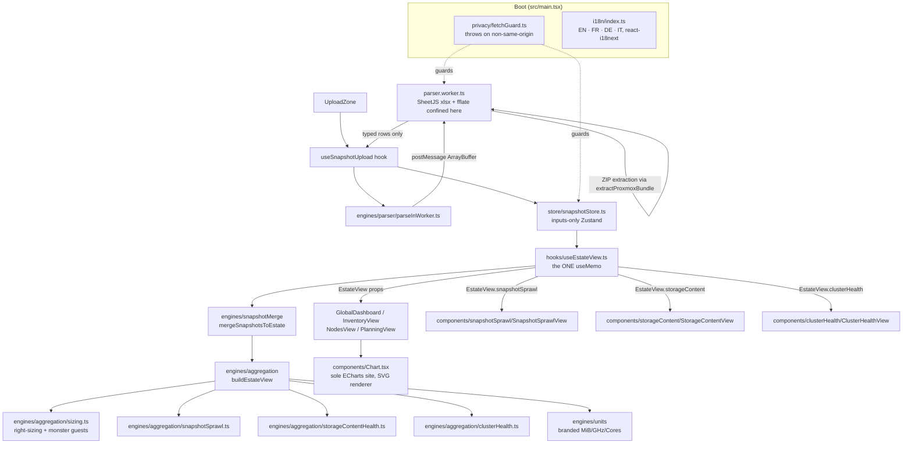

<!-- generated-by: gsd-doc-writer -->
# Architecture

## System overview

patlas is a 100% client-side React 19 + Vite 8 single-page application. It ingests one or more Proxmox VE reports (as `.zip` bundles or bare `.xlsx` files) entirely in the browser, normalizes them into typed snapshot rows, merges the selected snapshots into a single logical Proxmox estate, derives every aggregate (totals, allocation ratios, per-cluster/per-node/per-storage breakdowns, snapshot sprawl, storage content, cluster health) as pure functions, and renders dashboards, inventory trees, node views, capacity planning, and the three Proxmox-native health views. No report byte ever leaves the browser — a runtime privacy guard throws synchronously on any non-same-origin network attempt. The architecture is a strict three-tier separation: a pure-function **engines** layer (no React/DOM/Zustand), an inputs-only **Zustand store**, and a UI layer bridged by exactly one `useMemo` site (`useEstateView`). Engineering principles are binding: KISS, DRY, functional programming — engines are pure, the store holds inputs only, and derived state is computed downstream, never cached. patlas is a fork of [vatlas](https://github.com/fjacquet/vatlas); the core spine is unchanged; the domain is remapped from VMware/RVTools to Proxmox.

## Component diagram



The data-flow direction `A → B` means A calls or sends data to B. SheetJS (`xlsx`) and `fflate` are confined to `parser.worker.ts` and never imported on the main thread. ECharts is imported only in `components/Chart.tsx`.

## Data flow

A typical request — a user drops one or more Proxmox report files and views the dashboard — moves through the system as follows:

1. **Boot.** `src/main.tsx` imports `./privacy/fetchGuard` as its first statement, before any other module. The guard monkey-patches `globalThis.fetch`, `XMLHttpRequest.prototype.open`, `navigator.sendBeacon`, and `globalThis.WebSocket` to throw synchronously on any non-same-origin URL (`PrivacyViolation`) or cleartext WebSocket scheme (`InsecureTransportViolation`). `./i18n` initializes next so translation keys resolve on first paint.
2. **Upload.** `components/UploadZone.tsx` accepts `.zip` and `.xlsx` files. It hands dropped `File[]` to the `useSnapshotUpload` hook (`src/hooks/useSnapshotUpload.ts`), which processes files sequentially.
3. **Parse in a Web Worker.** For each file, `engines/parser/parseInWorker.ts` reads the file into an `ArrayBuffer` and `postMessage`s it (zero-copy transferable) to a module-scope singleton Worker (`engines/parser/parser.worker.ts`). The worker re-imports the same `fetchGuard` at its top (workers have their own global scope). It sniffs the ZIP magic bytes; if a `.zip`, it calls `extractProxmoxBundle` (using `fflate`) to unzip and extract `report.xlsx`. It then runs `parseXlsx` (the only `xlsx` import site), which dispatches to the Proxmox parser adapter (`adapters/proxmox.ts`). The adapter normalizes columns into canonical typed rows and, for stacked composite sheets (`Cluster HA` / `Cluster`), uses the `extractStackedSection` helper which reads `ParsedSheet.cells` to locate sub-table boundaries. The worker posts back **only the canonical typed rows** — the raw SheetJS workbook and decompressed bytes are scoped to the handler and GC-eligible the moment the handler returns.
4. **Store the input.** `useSnapshotUpload` calls `useSnapshotStore.getState().addSnapshot(...)` with a fresh `crypto.randomUUID()` id. The store appends the `Snapshot` to an immutable `Map<string, Snapshot>` (the Map reference is *replaced*, never mutated, so Zustand's `Object.is` subscribers re-render) and auto-adds the id to `selectedSnapshotIds`.
5. **Derive the estate view.** Components call `useEstateView(mode: AccountingMode): EstateView` (`src/hooks/useEstateView.ts`) — the project's single sanctioned `useMemo` site. The planned allocation ratios are read from the store inside the hook (via `selectPlannedRatios`), not passed as an argument. Inside the one memo it filters the store's `Snapshot` Map by `selectedSnapshotIds`, calls `mergeSnapshotsToEstate(selected)` to flatten and dedupe rows into one `MergedEstate`, then `buildEstateView(merged, mode, opts)` which composes per-cluster/per-node/per-storage aggregates plus the three Proxmox-native slices (`snapshotSprawl`, `storageContent`, `clusterHealth`). Returns the frozen `EMPTY_VIEW` when nothing is selected.
6. **Render.** `App.tsx` switches between `GlobalDashboard`, `InventoryView`, `NodesView`, `PlanningView`, `SnapshotSprawlView`, `StorageContentView`, and `ClusterHealthView` based on `ViewToggle` state. The three Proxmox-native views are web-only and do not appear in the HTML report or PPTX deck. Each view consumes the memoized `EstateView` as plain props and must not introduce its own `useMemo`. Charts route through the single `components/Chart.tsx` primitive, which injects the SVG renderer and the Midnight Executive theme.

On browser refresh all data is gone by construction: the store's `new Map()` runs at module scope on every load, and no dataset rows are written to web storage (ADR-0001).

## Key abstractions

| Abstraction | File | Role |
|---|---|---|
| `useSnapshotStore` (Zustand) | `src/store/snapshotStore.ts` | Inputs-only store: `Map<id, Snapshot>`, `selectedSnapshotIds`, `plannedRatios`. Caches no aggregates — a deliberate deviation from vatlas's `datasetStore`. Stable selectors only. |
| `useEstateView` | `src/hooks/useEstateView.ts` | The single `useMemo` in non-test `src/`; the only bridge from store to UI/exports. Orchestrates merge + aggregation; contains no domain logic itself. |
| `buildEstateView` / `EMPTY_VIEW` | `src/engines/aggregation/estateView.ts` | Pure estate-view assembler — composes globals, per-cluster, per-node, per-storage, OS breakdown, Snapshot Sprawl, Storage Content, and Cluster Health into one `EstateView`. No React/Zustand/Zod. |
| `mergeSnapshotsToEstate` | `src/engines/snapshotMerge/mergeSnapshotsToEstate.ts` | Pure: flattens N selected snapshots into one `MergedEstate`, deduping guests first-occurrence-wins by `guestId` with a `(cluster, guestName)` fallback. |
| `adapters/proxmox.ts` | `src/engines/parser/adapters/proxmox.ts` | Proxmox-specific sheet-to-row normalizer. Maps Proxmox report column names to canonical types; produces `ProxmoxGuestRow`, `ProxmoxNodeRow`, `ProxmoxStorageRow`, `ProxmoxSnapshotRow`, `ProxmoxStorageContentRow`, `ProxmoxHaRow`, and `ProxmoxBackupJobRow`. |
| `extractStackedSection` | `src/engines/parser/extractStackedSection.ts` | Composite-sheet helper. Uses `ParsedSheet.cells` to locate sub-table boundaries within stacked sheets (e.g. `Cluster HA` / `Cluster`), returning each named section as a typed row array. |
| `snapshotSprawl` | `src/engines/aggregation/snapshotSprawl.ts` | Pure: aggregates `ProxmoxSnapshotRow[]` (excluding the `current` live-state marker) into the `SnapshotSprawlView` slice: count, guests-with-snapshots, total size, oldest age. |
| `storageContentHealth` | `src/engines/aggregation/storageContentHealth.ts` | Pure: aggregates `ProxmoxStorageContentRow[]` into the `StorageContentView` slice: per-storage by content type, backup-file inventory with per-guest recency. |
| `clusterHealth` | `src/engines/aggregation/clusterHealth.ts` | Pure: aggregates `ProxmoxHaRow[]` + `ProxmoxBackupJobRow[]` into the `ClusterHealthView` slice: quorum/fencing state, HA-managed guest resources, scheduled backup jobs. |
| Branded units | `src/engines/units/types.ts` | `MiB`/`GiB`/`TiB`/`Bytes`/`MHz`/`GHz`/`Cores`/`Sockets` — runtime is a plain `number`; the brand makes passing an unconverted value to a typed parameter a compile error. Report "MB" is read as MiB with no conversion (ADR-0010). |
| `parseInWorker` | `src/engines/parser/parseInWorker.ts` | Main-thread surface for parsing. Must not import `xlsx` or `fflate`; spawns one module-scope singleton worker; transfers the `ArrayBuffer` (neutered after post). |
| `parser.worker.ts` | `src/engines/parser/parser.worker.ts` | The only `xlsx` (SheetJS) and `fflate` import site. Calls `extractProxmoxBundle` for `.zip` inputs; posts back typed rows only — never the SheetJS workbook, never `error.cause`. |
| `extractProxmoxBundle` | `src/engines/parser/extractProxmoxBundle.ts` | ZIP-sniffing extractor (uses `fflate`). Detects ZIP magic bytes, decompresses the bundle, and returns the `report.xlsx` `Uint8Array`. A bare `.xlsx` ArrayBuffer is returned unchanged. |
| `fetchGuard` | `src/privacy/fetchGuard.ts` | Side-effect module, no exports. Monkey-patches network globals to throw synchronously on non-same-origin / cleartext transport. Imported first in `main.tsx` and at the top of the worker. |
| `Chart` | `src/components/Chart.tsx` | The single ECharts import site. Tree-shaken `echarts/core` registry; SVG renderer mandated (canvas never imported); single `option` prop; `memo` with reference-equality on `option`. |
| `EstateView` (and `AccountingMode`) | `src/types/estate.ts` | The typed contract every dashboard component and export consumes. Includes slices: `.sizing`, `.monsters`, `.snapshotSprawl`, `.storageContent`, `.clusterHealth`. `AccountingMode` is `'configured' \| 'active' \| 'storage-realistic'`. |

## Directory structure rationale

The project is organized to make the three-tier separation (pure engines / inputs-only store / UI) structurally enforceable rather than merely conventional.

```
src/
├── main.tsx              Entry: fetchGuard first, then i18n, then <App/> in StrictMode
├── App.tsx               Shell: ErrorBoundary, header, ViewToggle, view switch
├── privacy/              The runtime privacy/transport guard (ADR-0001) + tests
├── engines/              Pure functions ONLY — no React/DOM/Zustand/Zod (Zod only at parser boundary). Vitest-gated ≥75%.
│   ├── parser/           Report parsing; SheetJS + fflate confined to parser.worker.ts; Zod schemas at the boundary
│   │   ├── adapters/     proxmox.ts — Proxmox sheet-to-row normalizer
│   │   ├── extractProxmoxBundle.ts   ZIP-sniffing extractor (fflate)
│   │   └── extractStackedSection.ts  Composite-sheet sub-table extractor (ParsedSheet.cells)
│   ├── snapshotMerge/    Flatten + dedupe selected snapshots into one MergedEstate
│   ├── aggregation/      buildEstateView and all per-cluster/node/storage aggregates
│   │   ├── snapshotSprawl.ts         Snapshot Sprawl slice (ProxmoxSnapshotRow[])
│   │   ├── storageContentHealth.ts   Storage Content slice (ProxmoxStorageContentRow[])
│   │   ├── clusterHealth.ts          Cluster Health slice (ProxmoxHaRow[] + ProxmoxBackupJobRow[])
│   │   ├── sizing.ts                 Right-sizing + monster guests
│   │   └── estateView.ts             buildEstateView assembler + EMPTY_VIEW
│   └── units/            Branded unit types + converters (MiB/GHz/Cores; ADR-0010)
├── store/                snapshotStore.ts — inputs-only Zustand, no cached aggregates
├── hooks/                useEstateView (the ONE useMemo), useSnapshotUpload, useTheme, etc.
├── components/           UI. Subfolders per view: dashboard/, inventory/, nodes/, planning/, cluster/
│   ├── snapshotSprawl/   SnapshotSprawlView (web-only)
│   ├── storageContent/   StorageContentView (web-only)
│   ├── clusterHealth/    ClusterHealthView (web-only)
│   └── Chart.tsx         The sole ECharts import site (SVG renderer)
├── types/                Shared TypeScript contracts (snapshot, estate, proxmox rows)
├── i18n/                 react-i18next setup; locales/en + locales/fr + locales/de + locales/it
├── theme/                ECharts Midnight Executive light/dark theme tokens
├── utils/                Small pure helpers (format, csv, oneLine)
├── test/                 Vitest setup + shared test array helpers
├── __fixtures__/         Test report files incl. the MiB canary (ADR-0010 guard)
└── __tests__/            Cross-cutting smoke / stress tests
```

- **`engines/` exists to hold the binding "pure functions only" rule.** It imports no React, DOM, Zustand, or Zod (Zod lives only at the parser boundary). This is the layer Vitest gates at ≥75% coverage. If two features would compute the same thing, the second imports from the first (DRY).
- **`store/` is intentionally a single file holding inputs only.** It caches no aggregates — a deliberate deviation from vatlas's `datasetStore`, because patlas mutates along more axes (multi-report, rename, recapture) and cached aggregates would multiply the invalidation surface. The KISS choice is to derive, not store.
- **`hooks/useEstateView.ts` is the only place `useMemo` lives** for estate aggregation — a grep-gated single-memo invariant. It is the one bridge from store to UI; components consume its output, never the engines directly.
- **`components/` is split per view** so each top-level navigation target (dashboard, inventory, nodes, planning, snapshotSprawl, storageContent, clusterHealth) is self-contained, plus shared cross-view folders (`cluster/`).
- **The three Proxmox-native views** (`snapshotSprawl/`, `storageContent/`, `clusterHealth/`) are web-only. They consume `EstateView` slices from `useEstateView` and are not wired into the HTML report or PPTX export engines.
- **`privacy/` is isolated** so the guard is a single auditable side-effect module imported first in both the main thread and the worker (ADR-0001 enumerates the enforcement points).
